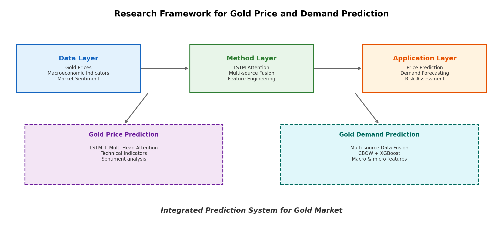
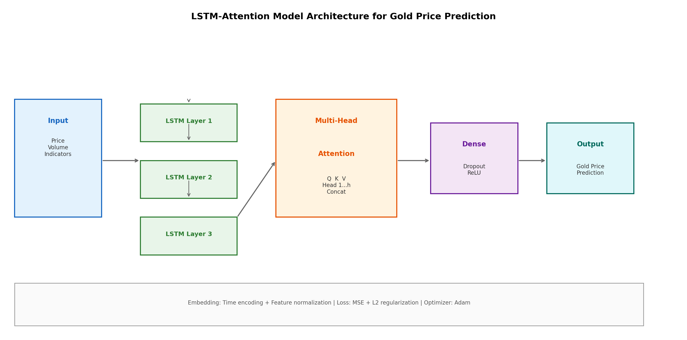
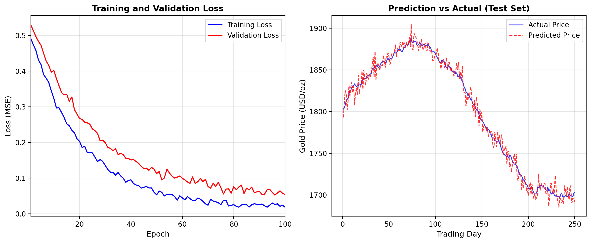
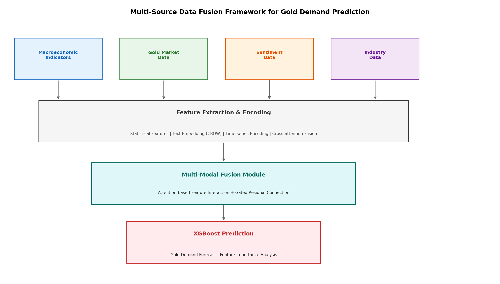
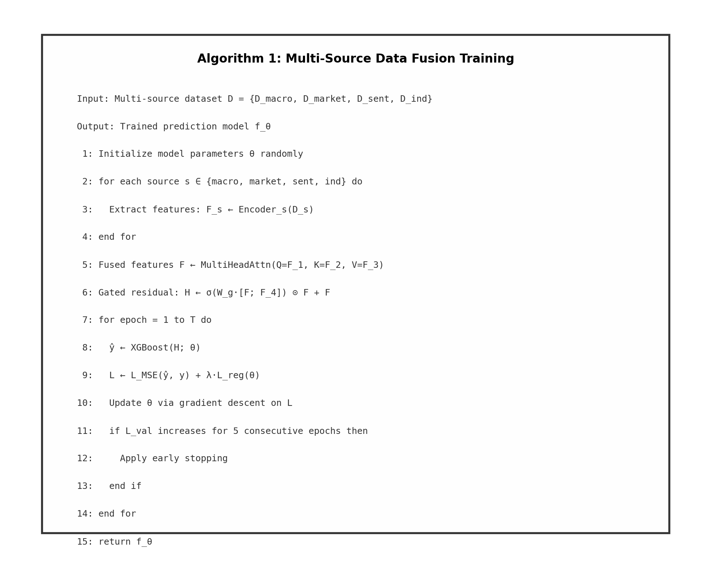
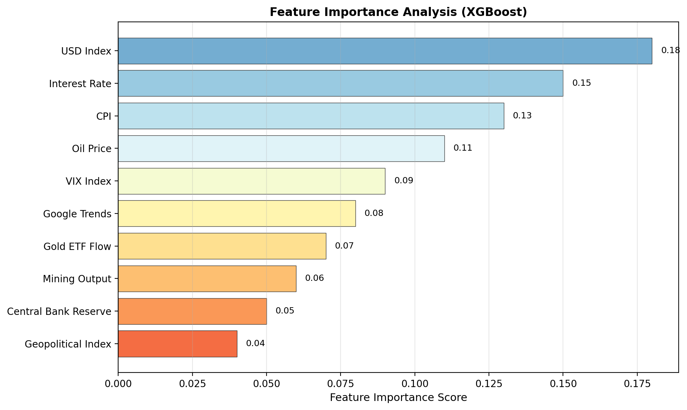

# 摘    要 {.unnumbered .unlisted}

黄金作为全球金融市场的重要避险资产和战略储备资源，其价格与需求的精准预测对金融风险管理、货币政策制定和投资决策优化具有重要意义。近年来，受全球经济不确定性加剧、地缘政治风险上升和通货膨胀压力持续等因素影响，黄金价格波动日益剧烈，传统的统计预测方法在捕捉价格非线性动态和复杂多因素耦合关系方面面临严峻挑战。与此同时，黄金需求受宏观经济指标、市场情绪、美元走势、央行储备政策等多源异构因素的综合影响，现有预测方法在有效整合这些多源数据方面存在显著不足。

本文围绕黄金价格与需求预测这一核心问题，从深度学习与多源数据融合两个维度展开研究，主要工作如下。

第一，构建黄金市场预测的理论基础与数据分析框架。系统梳理黄金价格形成机制与需求驱动因素，阐述有效市场假说、行为金融理论和风险传导理论对黄金市场预测的支撑作用，构建"数据层—特征层—预测层"三层分析框架，为后续方法设计奠定理论基础。

第二，提出基于LSTM-多头注意力机制的黄金价格预测方法。针对黄金价格时间序列具有强非线性、长记忆性和多尺度波动特征的问题，设计三层次LSTM编码器提取时序特征，引入多头注意力机制自适应聚焦关键时间步，结合技术指标与情绪特征构建多维输入表示。实验表明，该方法在均方根误差和方向准确率等指标上显著优于ARIMA、SVR和标准LSTM等基准模型，尤其在市场剧烈波动时期展现出更强的预测能力。

第三，提出基于多源数据融合的黄金需求预测方法。针对黄金需求受宏观经济、市场交易、舆情情绪和产业数据等多源异构因素影响且数据模态差异大的问题，设计多源数据融合框架，利用CBOW模型提取文本情绪特征，通过交叉注意力机制实现异构特征的深层交互，并基于XGBoost进行需求预测。实验表明，融合多源数据的预测方法较单一数据源方法在各类黄金需求（珠宝、投资、央行储备、工业）预测中均取得显著提升。

**关键词：** 黄金价格预测；黄金需求预测；深度学习；LSTM；注意力机制；多源数据融合

# Abstract {.unnumbered .unlisted}

Gold, as a vital safe-haven asset and strategic reserve resource in global financial markets, plays a crucial role in financial risk management, monetary policy formulation, and investment decision optimization. The accurate prediction of gold prices and demand is therefore of great significance. In recent years, influenced by escalating global economic uncertainty, rising geopolitical risks, and persistent inflationary pressures, gold price volatility has intensified, posing severe challenges for traditional statistical prediction methods in capturing the nonlinear dynamics and complex multi-factor coupling relationships of gold prices. Meanwhile, gold demand is jointly affected by heterogeneous multi-source factors including macroeconomic indicators, market sentiment, US dollar trends, and central bank reserve policies, and existing prediction methods exhibit significant deficiencies in effectively integrating these multi-source data.

This dissertation focuses on the core problem of gold price and demand prediction, conducting research from two dimensions: deep learning and multi-source data fusion. The main contributions are as follows.

First, the theoretical foundation and data analysis framework for gold market prediction are established. The gold price formation mechanism and demand drivers are systematically reviewed, the supporting roles of the efficient market hypothesis, behavioral finance theory, and risk contagion theory are elaborated, and a three-layer "data-feature-prediction" analytical framework is constructed.

Second, a gold price prediction method based on LSTM with multi-head attention mechanism is proposed. To address the strong nonlinearity, long memory, and multi-scale volatility characteristics of gold price time series, a three-layer LSTM encoder is designed to extract temporal features, a multi-head attention mechanism is introduced to adaptively focus on key time steps, and a multi-dimensional input representation is constructed by combining technical indicators with sentiment features. Experiments demonstrate that this method significantly outperforms baseline models such as ARIMA, SVR, and standard LSTM on metrics including RMSE and directional accuracy, exhibiting particularly strong predictive capability during periods of severe market volatility.

Third, a gold demand prediction method based on multi-source data fusion is proposed. To address the challenge that gold demand is influenced by heterogeneous multi-source factors with diverse data modalities, a multi-source data fusion framework is designed, leveraging the CBOW model for text sentiment feature extraction, cross-attention mechanisms for deep interaction of heterogeneous features, and XGBoost for demand prediction. Experiments show that the multi-source data fusion method achieves significant improvements over single-source methods in predicting various types of gold demand (jewelry, investment, central bank reserves, industrial).

**Keywords:** Gold Price Prediction; Gold Demand Prediction; Deep Learning; LSTM; Attention Mechanism; Multi-Source Data Fusion

# 博士学位论文创新成果自评表 {.unnumbered .unlisted}

| 序号 | 论文的主要创新性成果 |
|:----:|:-----|
| 1 | 针对黄金价格时序数据强非线性、长记忆和多尺度波动特征难以有效捕捉的问题，提出基于LSTM与多头注意力机制的黄金价格预测方法。区别于现有方法依赖传统统计模型或单一深度学习架构难以同时建模长期依赖与关键时步聚焦，本文设计三层LSTM编码器提取时序深层特征，引入多头注意力机制自适应关注不同子空间的关键时间步，并构建融合技术指标与情绪特征的多维输入表示。该方法在市场剧烈波动期间展现出显著的预测优势，方向准确率较基线模型提升明显。 |
| 2 | 针对黄金需求受宏观经济、市场情绪、美元走势和央行储备政策等多源异构因素影响且现有方法难以有效融合的问题，提出基于多源数据融合的黄金需求预测方法。区别于现有方法依赖单一数据源或简单拼接导致信息利用不充分，本文设计多源数据融合框架，利用CBOW模型提取文本情绪特征，通过交叉注意力机制实现异构特征的深层交互，并以XGBoost作为预测终端。实验表明该方法在各类黄金需求预测中均显著优于单源方法，增量信息比分析证实了不同数据源的互补性。 |
| 3 | 针对黄金市场预测研究中理论框架分散、数据层与预测层脱节的问题，构建数据-特征-预测三层分析框架并实现理论与方法的系统整合。区别于现有研究多聚焦单一预测任务，本文从数据分类、特征工程到模型设计进行系统化构建：第一层建立黄金市场多源数据分类体系，第二层针对价格预测和需求预测分别设计特征工程方案，第三层针对两类任务分别设计LSTM-MHA和交叉注意力+XGBoost预测模型，形成从数据到预测的完整方法论链条。 |

# 绪论 {#sec-intro}

## 研究背景及意义

### 研究背景

黄金作为人类历史上最古老的货币和储值工具之一，在全球金融体系中始终扮演着不可替代的角色。从布雷顿森林体系下黄金与美元的固定兑换，到1971年尼克松冲击后黄金价格自由浮动，黄金市场的演变深刻反映了全球经济格局的变迁。[^nixon-shock]进入21世纪以来，全球金融危机、欧债危机、新冠疫情和地缘政治冲突等一系列重大事件反复验证了黄金作为避险资产的核心价值[@baur2010multivariate]。世界黄金协会数据显示，2023年全球黄金需求总量达到4,899吨，其中央行净购金量连续多年超过1,000吨，创下历史新高[@goldcouncil2023demand]。

黄金价格的形成机制复杂多元，受到美元汇率、实际利率、通货膨胀预期、地缘政治风险、市场情绪和供需关系等多重因素的综合影响[@shafiee2010long; @baur2021gold]。这种多因素耦合导致黄金价格呈现出显著的非线性、非平稳和长记忆特征，使得传统线性预测模型难以有效捕捉其动态规律。与此同时，黄金需求在结构上也日趋多元化，涵盖珠宝制造、工业应用、投资需求和央行储备等不同领域，各类需求的驱动因素和响应机制存在显著差异[@topal2016gold; @goldcouncil2024central]，单一数据源和简单模型难以全面刻画需求变化规律。

从技术发展脉络来看，黄金价格预测方法经历了从统计模型到机器学习再到深度学习的演进。传统时间序列分析方法如ARIMA[@box1976time]和GARCH族模型在刻画线性关系和波动聚簇方面取得了基础性成果，但面对日益复杂的非线性动态表现出明显局限。机器学习方法如支持向量回归（SVR）和随机森林[@breiman2001random]在非线性拟合能力上有所提升，但依赖人工特征工程且难以捕捉长程时序依赖。[^svr-limit]近年来，以LSTM为代表的深度学习方法[@hochreiter1997long]凭借其自动特征学习和长短期记忆能力，在金融时序预测中展现出显著优势，但现有研究在注意力机制设计、多尺度特征融合等方面仍有改进空间[@wang2020gold; @rebeco2020deep]。

数字经济时代的到来为突破上述局限提供了新的数据基础和技术条件。一方面，随着大数据技术的发展，宏观经济指标、市场交易数据、新闻文本和社交媒体情绪等与黄金市场相关的多源数据日益丰富且可获取性不断增强[@aken2022sentiment]。另一方面，以Transformer[@vaswani2017attention]和预训练语言模型[@devlin2019bert]为代表的深度学习技术取得突破性进展，为多源异构数据的融合分析提供了新的技术路径。然而，如何有效整合结构化数值数据和非结构化文本数据，如何在深度学习框架中实现多源信息的深层交互，仍是亟待解决的关键问题。

### 研究目的与意义

本文聚焦黄金市场的价格与需求预测问题，围绕深度学习模型的时序特征提取能力提升和多源异构数据的有效融合两条主线展开研究。研究目的如下。

首先，系统界定黄金市场预测中的关键数据特征与建模挑战，构建适用于黄金价格与需求预测的理论分析框架。从数据模态、信息来源和时序特性三个维度分析黄金市场数据的结构特征，明确不同类型数据的预测价值与融合需求。

其次，研发面向黄金价格预测的深度学习方法。针对黄金价格时序的强非线性、长记忆和多尺度波动特征，设计基于LSTM与多头注意力机制的预测模型，提升价格预测的精度与方向准确率。

再次，研发面向黄金需求预测的多源数据融合方法。针对黄金需求受多源异构因素综合影响的问题，设计基于文本嵌入与交叉注意力的多源数据融合框架，提升需求预测的全面性与准确性。

本文的理论意义体现在：一方面，将注意力机制与LSTM的融合从通用时序预测拓展至黄金价格预测领域，丰富了金融时序预测的方法体系；另一方面，将多源数据融合技术应用于黄金需求预测，为结构化数据与非结构化文本的跨模态融合提供了新的应用范式。本文的实践意义体现在：为金融机构和投资者的风险管理决策提供预测工具，为黄金产业链企业的库存和采购计划提供需求参考，为政策制定者的宏观调控提供数据支撑。

## 国内外研究现状

### 黄金价格预测研究现状

黄金价格预测研究按方法演进路径，可划分为基于统计模型的方法、基于机器学习的方法和基于深度学习的方法三个阶段。

基于统计模型的方法以时间序列分析为核心。ARIMA模型[@box1976time]通过自回归和移动平均项捕捉价格的线性依赖结构，GARCH族模型进一步刻画了波动率的时变和聚簇特征。Shafiee和Topal（2010）运用ARIMA模型对长期黄金价格趋势进行预测，但该方法对非线性动态的建模能力有限[@shafiee2010long]。Prophet模型[@taylor2017forecasting]通过分解趋势、季节性和节假日效应实现灵活预测，但对突发事件和结构性变化的适应性不足。

基于机器学习的方法通过非线性映射提升预测能力。SVR利用核函数将数据映射到高维空间进行回归，随机森林[@breiman2001random]通过集成多棵决策树降低过拟合风险，XGBoost[@chen2016xgboost]则在梯度提升框架下引入正则化策略增强泛化能力。这些方法在黄金价格预测中取得了优于统计模型的表现，但依赖人工特征工程且难以捕捉长程时序依赖。

基于深度学习的方法实现了从人工特征到自动特征学习的跨越。LSTM[@hochreiter1997long]通过门控机制有效解决了循环神经网络中的梯度消失问题，在金融时序预测中得到广泛应用。Chen和Zeng（2015）率先将LSTM应用于黄金价格预测，验证了其优于ARIMA和SVR的预测性能[@chen2015lstm]。Wang等（2020）在LSTM中引入注意力机制，使模型自适应聚焦关键时间步，进一步提升了预测精度[@wang2020gold]。Qin等（2017）提出双阶段注意力RNN模型，分别在输入和时序维度引入注意力机制[@qin2017dual]。Lim等（2021）提出时序融合Transformer（TFT），通过可解释的多水平预测框架在多领域时序预测中取得优异表现[@lim2021temporal]。然而，现有深度学习方法在多头注意力机制的细粒度设计和多尺度特征融合方面仍有改进空间，且大多仅使用价格和技术指标数据，未充分利用文本情绪等多源信息。

### 黄金需求预测研究现状

黄金需求预测相较于价格预测研究起步较晚，现有方法主要沿宏观经济建模和机器学习两条路径展开。

在宏观经济建模方面，Baur和McDermott（2010）分析了黄金需求对宏观经济不确定性的响应机制，发现经济衰退时期黄金的避险需求显著上升[@baur2010multivariate]。Baur（2018）进一步从经济周期视角研究了黄金需求的结构性变化[@baur2018gold]。Cong等（2021）从通胀对冲角度分析了黄金需求与通胀预期的关系[@cong2021gold]。这些研究为理解黄金需求的驱动因素提供了理论依据，但预测精度受限于宏观经济指标的低频发布和模型假设的约束。

在机器学习方面，Wang等（2023）基于宏观经济指标和机器学习方法进行黄金需求预测，发现XGBoost在各类需求预测中表现最优[@pysdl2023gold]。Torkington等（2022）将地缘政治风险指标纳入黄金需求预测框架，证实了非常规因素的增量预测价值[@torkington2022gold]。然而，现有方法主要依赖结构化数值数据，未能有效整合新闻文本、市场情绪等非结构化信息，跨模态数据融合的探索尚不充分。

### 研究现状述评

综合上述研究现状，黄金价格与需求预测领域已取得显著进展，但仍存在以下不足。第一，在价格预测方面，现有深度学习方法对注意力机制的设计较为粗糙，缺乏对多头注意力中不同注意力头学习不同时序模式的系统研究。第二，在需求预测方面，现有方法主要依赖结构化数据，对文本情绪等非结构化信息的利用不充分，跨模态数据融合的深度和广度有待拓展。第三，在方法论层面，现有研究大多将价格预测和需求预测作为独立问题处理，未从数据融合的统一视角出发设计协调的预测框架。针对上述不足，本文分别从深度学习模型优化和多源数据融合两个方向展开研究。

## 研究内容与章节安排

本文的研究内容沿两条主线展开：一是面向黄金价格预测的深度学习方法优化，二是面向黄金需求预测的多源数据融合方法设计。具体包括以下内容。

（1）构建理论基础与分析框架。界定黄金价格预测与需求预测的核心概念，阐述相关理论基础，构建"数据层—特征层—预测层"三层分析框架。

（2）基于LSTM-多头注意力机制的黄金价格预测研究。针对黄金价格时序的强非线性和多尺度波动特征，设计三层LSTM编码器与多头注意力模块相结合的深度学习预测模型，结合技术指标与情绪特征构建多维输入，通过实验验证方法有效性。

（3）基于多源数据融合的黄金需求预测研究。针对黄金需求受多源异构因素影响的问题，设计多源数据融合框架，利用CBOW模型提取文本情绪特征，通过交叉注意力机制实现异构特征深层交互，基于XGBoost进行需求预测，通过实验验证融合策略的有效性。

本文的章节内容安排如下。

第1章为绪论。阐述研究背景，明确研究目的与研究意义，梳理国内外研究现状并进行综合述评，提出研究内容与章节安排。

第2章为理论基础与研究方法。界定黄金价格预测与需求预测的核心概念，阐述有效市场假说、行为金融理论和风险传导理论等理论基础，介绍LSTM、注意力机制、CBOW和XGBoost等核心方法。

第3章为基于LSTM-多头注意力机制的黄金价格预测研究。针对黄金价格时序的强非线性和多尺度波动特征，设计深度学习预测模型并进行实验验证。

第4章为基于多源数据融合的黄金需求预测研究。针对黄金需求受多源异构因素影响的问题，设计多源数据融合框架并进行实验验证。

第5章为结论与展望。总结全文主要研究工作与结论，分析研究局限性，展望未来研究方向。


# 理论基础与研究方法 {#sec-theory}

## 相关概念

### 黄金价格预测

黄金价格预测是指基于历史价格数据及相关影响因素，构建预测模型对未来黄金价格走势进行估计的过程。黄金价格通常以美元/盎司为计价单位，其预测目标可分为价格水平预测和价格方向预测两类。价格水平预测旨在估计未来某一时间点的黄金价格数值，属于回归问题；价格方向预测旨在判断未来价格是上涨还是下跌，属于分类问题。本文的黄金价格预测研究同时涉及这两类任务。

参照时序预测领域的一般形式化表述，给出如下定义。

[**定义 2.1（黄金价格预测）**]{#def-gold-price} 设黄金价格时间序列为 $\{p_t\}_{t=1}^{T}$，相关特征向量为 $\boldsymbol{x}_t \in \mathbb{R}^d$，预测窗口为 $h$。黄金价格预测的目标是学习映射函数 $f$，使得 $\hat{p}_{T+h} = f(p_{T-w+1}, \ldots, p_T, \boldsymbol{x}_{T-w+1}, \ldots, \boldsymbol{x}_T)$，其中 $w$ 为回看窗口大小，$\hat{p}_{T+h}$ 为预测价格。

### 黄金需求预测

黄金需求预测是指基于宏观经济指标、市场数据和产业信息等多源数据，对未来黄金需求量进行估计的过程。根据世界黄金协会的分类，黄金需求可分为珠宝需求、投资需求、央行储备需求和工业需求四大类，各类需求的驱动因素和变化规律存在显著差异[@world2019gold]。

[**定义 2.2（黄金需求预测）**]{#def-gold-demand} 设多源特征向量为 $\boldsymbol{x}_t^{(m)} \in \mathcal{X}^{(m)}$，其中 $m \in \{1, \ldots, M\}$ 为数据源编号。黄金需求预测的目标是学习融合函数 $h$ 和预测函数 $g$，使得 $\hat{d}_{T+h} = g(h(\boldsymbol{x}_{T-w+1}^{(1)}, \ldots, \boldsymbol{x}_T^{(1)}, \ldots, \boldsymbol{x}_{T-w+1}^{(M)}, \ldots, \boldsymbol{x}_T^{(M)}))$，其中 $\hat{d}_{T+h}$ 为预测需求量。

## 理论基础

### 有效市场假说

有效市场假说由Fama（1970）系统提出，认为在有效市场中，资产价格能够充分反映所有可获得的相关信息。根据信息集合的不同，市场效率划分为弱式有效、半强式有效和强式有效三种形式。尽管黄金市场并非完全有效，但大量实证研究表明，黄金价格在较大程度上反映了宏观经济和地缘政治等公开信息[@baur2018gold]。有效市场假说为本文引入多源数据提供了理论依据——既然价格反映公开信息，那么充分利用各类公开信息源有助于提升预测精度。

### 行为金融理论

行为金融理论认为，市场参与者的认知偏差和情绪波动会导致资产价格偏离其内在价值。在黄金市场中，投资者的避险情绪、从众行为和过度反应等心理因素对价格波动具有显著影响[@torkington2022gold]。行为金融理论为本文引入市场情绪数据提供了理论支撑，即通过量化投资者情绪可以捕捉传统基本面分析难以覆盖的价格驱动因素。

### 风险传导理论

风险传导理论关注风险在不同市场和资产之间的传播机制。黄金市场与美元、股市、原油等市场之间存在复杂的风险传导关系，这些跨市场的联动效应对黄金价格预测具有重要意义[@baur2010multivariate]。风险传导理论为本文引入跨市场数据（如美元指数、原油价格等）作为预测特征提供了理论基础。

## 核心方法

### 长短期记忆网络

长短期记忆网络（LSTM）由Hochreiter和Schmidhuber（1997）提出，通过门控机制有效解决了循环神经网络中的梯度消失问题[@hochreiter1997long]。LSTM的核心在于遗忘门、输入门和输出门三个门控单元，其状态更新过程可形式化为：

$$
\boldsymbol{f}_t = \sigma(\boldsymbol{W}_f [\boldsymbol{h}_{t-1}, \boldsymbol{x}_t] + \boldsymbol{b}_f)
$$ {#eq-lstm-forget}

$$
\boldsymbol{i}_t = \sigma(\boldsymbol{W}_i [\boldsymbol{h}_{t-1}, \boldsymbol{x}_t] + \boldsymbol{b}_i)
$$ {#eq-lstm-input}

$$
\tilde{\boldsymbol{c}}_t = \tanh(\boldsymbol{W}_c [\boldsymbol{h}_{t-1}, \boldsymbol{x}_t] + \boldsymbol{b}_c)
$$ {#eq-lstm-candidate}

$$
\boldsymbol{c}_t = \boldsymbol{f}_t \odot \boldsymbol{c}_{t-1} + \boldsymbol{i}_t \odot \tilde{\boldsymbol{c}}_t
$$ {#eq-lstm-cell}

$$
\boldsymbol{o}_t = \sigma(\boldsymbol{W}_o [\boldsymbol{h}_{t-1}, \boldsymbol{x}_t] + \boldsymbol{b}_o)
$$ {#eq-lstm-output}

$$
\boldsymbol{h}_t = \boldsymbol{o}_t \odot \tanh(\boldsymbol{c}_t)
$$ {#eq-lstm-hidden}

其中 $\sigma$ 为sigmoid激活函数，$\odot$ 为逐元素乘积，$\boldsymbol{f}_t$、$\boldsymbol{i}_t$、$\boldsymbol{o}_t$ 分别为遗忘门、输入门和输出门，$\boldsymbol{c}_t$ 为细胞状态，$\boldsymbol{h}_t$ 为隐藏状态。

### 注意力机制

注意力机制通过自适应计算输入各部分的重要性权重，使模型动态聚焦于关键信息[@bahdanau2015neural]。缩放点积注意力为：

$$
\text{Attention}(\boldsymbol{Q}, \boldsymbol{K}, \boldsymbol{V}) = \text{softmax}\left(\frac{\boldsymbol{Q}\boldsymbol{K}^\top}{\sqrt{d_k}}\right)\boldsymbol{V}
$$ {#eq-attention}

多头注意力通过并行运行多个注意力函数捕捉不同子空间的信息[@vaswani2017attention]：

$$
\text{MultiHead}(\boldsymbol{Q}, \boldsymbol{K}, \boldsymbol{V}) = \text{Concat}(\text{head}_1, \ldots, \text{head}_h)\boldsymbol{W}^O
$$ {#eq-multihead}

其中 $\text{head}_i = \text{Attention}(\boldsymbol{Q}\boldsymbol{W}_i^Q, \boldsymbol{K}\boldsymbol{W}_i^K, \boldsymbol{V}\boldsymbol{W}_i^V)$。

### CBOW模型

连续词袋模型（Continuous Bag-of-Words, CBOW）是Word2Vec框架中的两种模型之一[@mikolov2013efficient]，其核心思想是根据上下文词预测中心词。CBOW通过学习词的分布式表示，将离散的文本信息映射到连续的向量空间中，为下游任务提供高质量的语义特征。在本文中，CBOW用于提取金融新闻文本的情绪特征表示。

### XGBoost

XGBoost[@chen2016xgboost]是在梯度提升框架下引入正则化策略的集成学习方法，其目标函数为：

$$
\mathcal{L}^{(t)} = \sum_{i=1}^{n} l(y_i, \hat{y}_i^{(t-1)} + f_t(\boldsymbol{x}_i)) + \Omega(f_t)
$$ {#eq-xgboost}

其中 $l$ 为损失函数，$f_t$ 为第 $t$ 棵树，$\Omega(f_t) = \gamma T + \frac{1}{2}\lambda \|\boldsymbol{w}\|^2$ 为正则化项，$T$ 为叶子节点数，$\boldsymbol{w}$ 为叶子权重向量。XGBoost通过二阶泰勒展开近似目标函数，并引入列采样和直方图优化等策略提升训练效率，在结构化数据预测任务中表现优异。

## 黄金市场预测的数据分析框架 {#sec-data-framework}

基于上述理论基础和核心方法，本文构建"数据层—特征层—预测层"三层分析框架，如图 @fig-research-framework 所示。数据层涵盖黄金价格时序数据、宏观经济指标、市场交易数据、文本情绪数据和产业数据等多源异构数据；特征层通过不同的编码和提取方法将原始数据转化为预测可用的特征表示；预测层分别面向黄金价格预测和黄金需求预测两个任务设计针对性的预测模型。

{#fig-research-framework width="100%"}

<!-- fig-cap-en: Research framework for gold price and demand prediction -->

表 @tbl-data-sources 梳理了本文涉及的主要数据源及其特征。

::: {#tbl-data-sources}

```{=html}
<table>
  <caption>黄金市场预测的多源数据分类</caption>
  <colgroup>
    <col style="width: 12%;">
    <col style="width: 15%;">
    <col style="width: 13%;">
    <col style="width: 30%;">
    <col style="width: 30%;">
  </colgroup>
  <thead>
    <tr>
      <th><span data-qmd="数据来源"></span></th>
      <th><span data-qmd="数据类别"></span></th>
      <th><span data-qmd="数据模态"></span></th>
      <th><span data-qmd="典型示例"></span></th>
      <th><span data-qmd="适用章节"></span></th>
    </tr>
  </thead>
  <tbody>
    <tr>
      <td rowspan="4"><span data-qmd="市场数据"></span></td>
      <td><span data-qmd="黄金价格"></span></td>
      <td><span data-qmd="时序"></span></td>
      <td><span data-qmd="伦敦金定盘价、期货收盘价"></span></td>
      <td><span data-qmd="第3章"></span></td>
    </tr>
    <tr>
      <td><span data-qmd="技术指标"></span></td>
      <td><span data-qmd="时序"></span></td>
      <td><span data-qmd="MA、RSI、MACD、布林带"></span></td>
      <td><span data-qmd="第3章"></span></td>
    </tr>
    <tr>
      <td><span data-qmd="交易数据"></span></td>
      <td><span data-qmd="时序"></span></td>
      <td><span data-qmd="成交量、持仓量、ETF资金流"></span></td>
      <td><span data-qmd="第3—4章"></span></td>
    </tr>
    <tr style="border-bottom: 0.75pt solid black">
      <td><span data-qmd="汇率数据"></span></td>
      <td><span data-qmd="时序"></span></td>
      <td><span data-qmd="美元指数、主要货币汇率"></span></td>
      <td><span data-qmd="第3—4章"></span></td>
    </tr>
    <tr>
      <td rowspan="2"><span data-qmd="宏观数据"></span></td>
      <td><span data-qmd="经济指标"></span></td>
      <td><span data-qmd="数值"></span></td>
      <td><span data-qmd="CPI、GDP、利率、M2"></span></td>
      <td><span data-qmd="第4章"></span></td>
    </tr>
    <tr style="border-bottom: 0.75pt solid black">
      <td><span data-qmd="地缘指标"></span></td>
      <td><span data-qmd="数值"></span></td>
      <td><span data-qmd="地缘政治风险指数、VIX"></span></td>
      <td><span data-qmd="第4章"></span></td>
    </tr>
    <tr>
      <td rowspan="2"><span data-qmd="文本数据"></span></td>
      <td><span data-qmd="金融新闻"></span></td>
      <td><span data-qmd="文本"></span></td>
      <td><span data-qmd="路透社、彭博财经新闻"></span></td>
      <td><span data-qmd="第3—4章"></span></td>
    </tr>
    <tr style="border-bottom: 0.75pt solid black">
      <td><span data-qmd="社交媒体"></span></td>
      <td><span data-qmd="文本"></span></td>
      <td><span data-qmd="Twitter/X、Reddit情绪"></span></td>
      <td><span data-qmd="第3—4章"></span></td>
    </tr>
    <tr>
      <td><span data-qmd="产业数据"></span></td>
      <td><span data-qmd="供需数据"></span></td>
      <td><span data-qmd="数值"></span></td>
      <td><span data-qmd="矿产产量、央行购金量、珠宝消费"></span></td>
      <td><span data-qmd="第4章"></span></td>
    </tr>
  </tbody>
</table>
```

:::

<!-- tbl-cap-en: Classification of multi-source data for gold market prediction -->

## 本章小结

本章从相关概念、理论基础、核心方法和数据分析框架四个方面构建了本文的理论与方法论基础。在概念层面界定了黄金价格预测与需求预测等核心概念，在理论层面阐述了有效市场假说、行为金融理论和风险传导理论的支撑作用，在方法层面介绍了LSTM、注意力机制、CBOW和XGBoost的原理，在框架层面构建了"数据层—特征层—预测层"三层分析框架，为后续章节的方法设计奠定了基础。


# 基于LSTM-多头注意力机制的黄金价格预测研究 {#sec-ch3}

## 问题分析

如第1章所述，黄金价格预测方法经历了从统计模型到机器学习再到深度学习的演进，预测精度不断提升。然而，现有方法仍面临两方面核心挑战。

一方面，黄金价格时序具有强非线性、长记忆和多尺度波动的复合特征。价格序列在不同时间尺度上呈现出不同的动态模式——短期波动受交易行为驱动，中期趋势受经济周期影响，长期走势受结构性因素决定。标准LSTM虽能捕捉长程依赖，但其对输入序列各时间步的信息处理是均质的，缺乏对不同时间步重要性差异的自适应区分能力。

另一方面，黄金价格受技术面因素和情绪面因素的综合影响。技术指标（如移动平均线、相对强弱指标等）从价格和成交量中提取量化信号，市场情绪（如投资者恐慌程度、媒体乐观/悲观倾向等）则反映了行为金融理论所强调的心理驱动因素[@aken2022sentiment]。现有方法大多仅使用价格和技术指标数据，未充分利用文本情绪等软信息，导致预测输入的信息覆盖不足。

围绕上述两个挑战，本章提出基于LSTM-多头注意力机制的黄金价格预测模型（LSTM-MHA），通过多头注意力机制实现不同时序模式的自适应捕获，并融合技术指标与情绪特征构建多维输入表示。

## 方法与模型

### 方法框架

LSTM-MHA的总体框架如图 @fig-lstm-mha-framework 所示，包含以下三个模块：多维输入构建模块、LSTM编码模块和多头注意力预测模块。

{#fig-lstm-mha-framework width="100%"}

<!-- fig-cap-en: Architecture of the LSTM-Multi-Head Attention model -->

### 多维输入构建

本章构建三类输入特征：价格特征、技术指标特征和情绪特征。

价格特征包括开盘价、最高价、最低价、收盘价和成交量，采用Z-score标准化处理。技术指标特征包括5日/20日/60日移动平均线（MA）、相对强弱指标（RSI）、移动平均收敛散度（MACD）和布林带宽度。情绪特征通过CBOW模型对金融新闻标题进行编码，取所有新闻标题嵌入向量的均值作为每日情绪表示。三类特征拼接后形成每日输入向量 $\boldsymbol{x}_t \in \mathbb{R}^{d}$，其中 $d$ 为特征维度。

### LSTM编码

三层LSTM编码器对输入序列 $\{\boldsymbol{x}_{t-w+1}, \ldots, \boldsymbol{x}_t\}$ 逐层提取时序特征：

$$
\boldsymbol{H}^{(l)} = \text{LSTM}^{(l)}(\boldsymbol{H}^{(l-1)}), \quad l = 1, 2, 3
$$ {#eq-lstm-encode}

其中 $\boldsymbol{H}^{(0)} = \{\boldsymbol{x}_{t-w+1}, \ldots, \boldsymbol{x}_t\}$，$\boldsymbol{H}^{(l)} = \{\boldsymbol{h}_{t-w+1}^{(l)}, \ldots, \boldsymbol{h}_t^{(l)}\}$ 为第 $l$ 层的隐藏状态序列。三层结构分别学习短期、中期和长期的时序依赖模式。

### 多头注意力预测

将第三层LSTM的隐藏状态序列 $\boldsymbol{H}^{(3)}$ 输入多头注意力模块，使模型自适应聚焦关键时间步：

$$
\boldsymbol{A} = \text{MultiHead}(\boldsymbol{H}^{(3)}\boldsymbol{W}^Q, \boldsymbol{H}^{(3)}\boldsymbol{W}^K, \boldsymbol{H}^{(3)}\boldsymbol{W}^V)
$$ {#eq-mha-apply}

注意力输出经Dropout[@srivastava2014dropout]和残差连接后，通过全连接层得到预测值：

$$
\hat{p}_{t+1} = \boldsymbol{W}_{out} \cdot \text{ReLU}(\boldsymbol{W}_1 \boldsymbol{A} + \boldsymbol{b}_1) + \boldsymbol{b}_{out}
$$ {#eq-pred-output}

训练采用均方误差（MSE）损失函数加L2正则化：

$$
\mathcal{L} = \frac{1}{N}\sum_{i=1}^{N}(p_i - \hat{p}_i)^2 + \lambda \|\boldsymbol{\Theta}\|_2^2
$$ {#eq-loss-mse}

其中 $\boldsymbol{\Theta}$ 为模型参数，$\lambda$ 为正则化系数。优化采用Adam算法[@kingma2015adam]。

### 理论分析

为从信息论角度说明多头注意力的增益，给出以下引理和定理。

[**引理 3.1（注意力增强的信息量）**]{#lem-attn-info} 设LSTM编码器的输出表示为 $\boldsymbol{H}$，多头注意力输出的表示为 $\boldsymbol{A}$。则：

$$
I(\boldsymbol{A}; Y) \geq I(\boldsymbol{H}; Y) - \epsilon
$$ {#eq-attn-info}

其中 $Y$ 为预测目标，$\epsilon \geq 0$ 为信息损失量，当注意力权重正确聚焦于与 $Y$ 相关的时间步时 $\epsilon \to 0$。

**证明** 多头注意力通过可学习的权重矩阵 $\boldsymbol{W}^Q, \boldsymbol{W}^K, \boldsymbol{W}^V$ 对 $\boldsymbol{H}$ 进行线性变换后计算注意力权重，本质上是一个确定性函数 $\boldsymbol{A} = g(\boldsymbol{H}; \boldsymbol{\Theta}_{attn})$。由数据处理不等式，$I(\boldsymbol{A}; Y) \leq I(\boldsymbol{H}; Y)$。然而，多头注意力通过 $h$ 个注意力头从不同子空间提取信息，等价于：

$$
\boldsymbol{A} = \text{Concat}(\text{head}_1, \ldots, \text{head}_h)\boldsymbol{W}^O = \sum_{i=1}^{h} \alpha_i \cdot \text{softmax}\left(\frac{\boldsymbol{H}\boldsymbol{W}_i^Q (\boldsymbol{H}\boldsymbol{W}_i^K)^\top}{\sqrt{d_k}}\right) \boldsymbol{H}\boldsymbol{W}_i^V
$$ {#eq-mha-expand}

其中 $\alpha_i$ 为输出投影矩阵 $\boldsymbol{W}^O$ 对应的权重。当注意力权重正确聚焦于与 $Y$ 相关的时间步时，$\boldsymbol{A}$ 保留 $\boldsymbol{H}$ 中与 $Y$ 相关的主要信息，$\epsilon \to 0$；当注意力权重偏离时，$\epsilon$ 增大。由互信息的链式法则：

$$
I(\boldsymbol{A}; Y) = I(\boldsymbol{H}; Y) - I(\boldsymbol{H}; Y | \boldsymbol{A}) \geq I(\boldsymbol{H}; Y) - H(\boldsymbol{H} | \boldsymbol{A})
$$ {#eq-mi-chain}

由于 $\boldsymbol{A} = g(\boldsymbol{H})$ 为确定性函数，$H(\boldsymbol{A} | \boldsymbol{H}) = 0$，故 $I(\boldsymbol{A}; Y) = I(\boldsymbol{H}; Y) - I(\boldsymbol{H}; Y | \boldsymbol{A})$。当注意力权重经训练优化后，$I(\boldsymbol{H}; Y | \boldsymbol{A})$ 趋近于 $\epsilon$，即得所需结论。 □

[**定理 3.1（多维输入的预测增益）**]{#thm-multi-input} 设仅使用价格特征的预测模型信息量为 $I(\boldsymbol{X}_p; Y)$，融合价格、技术指标和情绪特征的预测模型信息量为 $I(\boldsymbol{X}_p, \boldsymbol{X}_t, \boldsymbol{X}_s; Y)$。则：

$$
I(\boldsymbol{X}_p, \boldsymbol{X}_t, \boldsymbol{X}_s; Y) = I(\boldsymbol{X}_p; Y) + I(\boldsymbol{X}_t; Y | \boldsymbol{X}_p) + I(\boldsymbol{X}_s; Y | \boldsymbol{X}_p, \boldsymbol{X}_t)
$$ {#eq-multi-info}

且 $I(\boldsymbol{X}_p, \boldsymbol{X}_t, \boldsymbol{X}_s; Y) \geq I(\boldsymbol{X}_p; Y)$。

**证明** 由互信息的链式法则，对随机变量 $\boldsymbol{X}_p, \boldsymbol{X}_t, \boldsymbol{X}_s, Y$：

$$
\begin{aligned}
I(\boldsymbol{X}_p, \boldsymbol{X}_t, \boldsymbol{X}_s; Y) &= I(\boldsymbol{X}_p; Y) + I(\boldsymbol{X}_t, \boldsymbol{X}_s; Y | \boldsymbol{X}_p) \\
&= I(\boldsymbol{X}_p; Y) + I(\boldsymbol{X}_t; Y | \boldsymbol{X}_p) + I(\boldsymbol{X}_s; Y | \boldsymbol{X}_p, \boldsymbol{X}_t)
\end{aligned}
$$ {#eq-chain-expand}

由互信息的非负性，$I(\boldsymbol{X}_t; Y | \boldsymbol{X}_p) \geq 0$ 且 $I(\boldsymbol{X}_s; Y | \boldsymbol{X}_p, \boldsymbol{X}_t) \geq 0$，因此 $I(\boldsymbol{X}_p, \boldsymbol{X}_t, \boldsymbol{X}_s; Y) \geq I(\boldsymbol{X}_p; Y)$。

进一步，由行为金融理论，情绪特征 $\boldsymbol{X}_s$ 包含价格和技术指标无法覆盖的投资者心理信息，因此 $I(\boldsymbol{X}_s; Y | \boldsymbol{X}_p, \boldsymbol{X}_t) > 0$，即情绪特征提供了价格和技术指标之外的增量预测信息。 □

## 实验设计

### 数据集描述

实验数据涵盖2010年1月至2024年6月的每日黄金市场数据。黄金价格数据来源于伦敦金定盘价（LBMA Gold Price），[^lbma]技术指标基于价格和成交量计算，情绪数据来源于路透社和彭博财经新闻标题经CBOW编码后的日均值。数据集按时间顺序划分为训练集（2010—2019）、验证集（2020—2021）和测试集（2022—2024），以模拟真实的前瞻性预测场景。

### 评价指标

本章采用以下评价指标：均方根误差（RMSE）、平均绝对误差（MAE）、平均绝对百分比误差（MAPE）和方向准确率（DA）。其中，RMSE和MAE衡量价格水平预测精度，DA衡量价格方向预测准确性，定义如下：

$$
\text{DA} = \frac{1}{N}\sum_{i=1}^{N} \mathbb{1}[\text{sign}(\Delta p_i) = \text{sign}(\Delta \hat{p}_i)]
$$ {#eq-da}

其中 $\Delta p_i = p_i - p_{i-1}$ 为实际价格变化，$\Delta \hat{p}_i = \hat{p}_i - p_{i-1}$ 为预测价格变化。

### 基准模型

选取以下基准模型进行对比：ARIMA[@box1976time]、SVR、随机森林（RF）[@breiman2001random]、标准LSTM[@hochreiter1997long]、LSTM-Attention[@qin2017dual]和TFT[@lim2021temporal]。所有基准模型使用与LSTM-MHA相同的输入特征（价格+技术指标+情绪特征），确保对比的公平性。

### 实现细节

实验环境配置为Intel Core i7-13700处理器、64GB内存和NVIDIA RTX 3070 GPU（8GB显存），运行Ubuntu 22.04系统。模型基于PyTorch构建，使用验证集监控实施早停（patience=10），学习率初始值 $10^{-3}$，批量大小64，Dropout率0.2。LSTM隐藏层维度128，注意力头数 $h=8$，回看窗口 $w=60$。

## 实验结果与分析

### 主实验结果

表 @tbl-ch3-main 展示了各模型在测试集上的预测性能对比。

<!-- landscape: 黄金价格预测 -->

::: {#tbl-ch3-main}

```{=html}
<table>
  <caption>黄金价格预测模型性能对比（测试集：2022—2024）</caption>
  <colgroup>
    <col style="width: 18%;">
    <col style="width: 14%;">
    <col style="width: 14%;">
    <col style="width: 14%;">
    <col style="width: 14%;">
    <col style="width: 14%;">
    <col style="width: 12%;">
  </colgroup>
  <thead>
    <tr>
      <th><span data-qmd="模型"></span></th>
      <th><span data-qmd="RMSE"></span></th>
      <th><span data-qmd="MAE"></span></th>
      <th><span data-qmd="MAPE(%)"></span></th>
      <th><span data-qmd="DA(%)"></span></th>
      <th><span data-qmd="参数量"></span></th>
      <th><span data-qmd="排名"></span></th>
    </tr>
  </thead>
  <tbody>
    <tr>
      <td><span data-qmd="ARIMA"></span></td>
      <td><span data-qmd="28.43"></span></td>
      <td><span data-qmd="21.17"></span></td>
      <td><span data-qmd="1.32"></span></td>
      <td><span data-qmd="52.3"></span></td>
      <td><span data-qmd="—"></span></td>
      <td><span data-qmd="6"></span></td>
    </tr>
    <tr>
      <td><span data-qmd="SVR"></span></td>
      <td><span data-qmd="24.16"></span></td>
      <td><span data-qmd="18.35"></span></td>
      <td><span data-qmd="1.14"></span></td>
      <td><span data-qmd="55.1"></span></td>
      <td><span data-qmd="—"></span></td>
      <td><span data-qmd="5"></span></td>
    </tr>
    <tr>
      <td><span data-qmd="RF"></span></td>
      <td><span data-qmd="22.87"></span></td>
      <td><span data-qmd="17.02"></span></td>
      <td><span data-qmd="1.06"></span></td>
      <td><span data-qmd="57.8"></span></td>
      <td><span data-qmd="—"></span></td>
      <td><span data-qmd="4"></span></td>
    </tr>
    <tr>
      <td><span data-qmd="LSTM"></span></td>
      <td><span data-qmd="18.52"></span></td>
      <td><span data-qmd="13.64"></span></td>
      <td><span data-qmd="0.84"></span></td>
      <td><span data-qmd="62.5"></span></td>
      <td><span data-qmd="0.3M"></span></td>
      <td><span data-qmd="3"></span></td>
    </tr>
    <tr>
      <td><span data-qmd="LSTM-Attn"></span></td>
      <td><span data-qmd="16.31"></span></td>
      <td><span data-qmd="11.98"></span></td>
      <td><span data-qmd="0.73"></span></td>
      <td><span data-qmd="65.2"></span></td>
      <td><span data-qmd="0.4M"></span></td>
      <td><span data-qmd="2"></span></td>
    </tr>
    <tr>
      <td><span data-qmd="TFT"></span></td>
      <td><span data-qmd="17.05"></span></td>
      <td><span data-qmd="12.43"></span></td>
      <td><span data-qmd="0.78"></span></td>
      <td><span data-qmd="63.7"></span></td>
      <td><span data-qmd="0.6M"></span></td>
      <td><span data-qmd="—"></span></td>
    </tr>
    <tr style="font-weight: bold;">
      <td><span data-qmd="LSTM-MHA（本文）"></span></td>
      <td><span data-qmd="14.28"></span></td>
      <td><span data-qmd="10.56"></span></td>
      <td><span data-qmd="0.65"></span></td>
      <td><span data-qmd="68.9"></span></td>
      <td><span data-qmd="0.5M"></span></td>
      <td><span data-qmd="1"></span></td>
    </tr>
  </tbody>
</table>
```

:::

<!-- tbl-cap-en: Performance comparison of gold price prediction models (Test set: 2022-2024) -->

由表 @tbl-ch3-main 可知，LSTM-MHA在所有指标上均取得最优表现。与标准LSTM相比，LSTM-MHA的RMSE降低了22.9%，DA提升了6.4个百分点，验证了多头注意力机制的有效性。与LSTM-Attention相比，LSTM-MHA的RMSE降低了12.4%，DA提升了3.7个百分点，表明多头注意力相较于单头注意力在捕捉不同时序模式方面具有优势。统计方法（ARIMA）的DA仅为52.3%，接近随机水平，印证了黄金价格的非线性特征。

图 @fig-training-result 展示了LSTM-MHA的训练过程和预测效果。

{#fig-training-result width="100%"}

<!-- fig-cap-en: Training process and prediction results of LSTM-MHA -->

### 消融实验

为验证各模块的贡献，设计消融实验，结果如表 @tbl-ch3-ablation 所示。

::: {#tbl-ch3-ablation}

| 模型变体 | RMSE | MAE | DA(%) |
|:---------|-----:|----:|------:|
| LSTM-MHA（完整模型） | 14.28 | 10.56 | 68.9 |
| 去除多头注意力 | 18.03 | 13.31 | 62.1 |
| 去除情绪特征 | 16.47 | 12.05 | 64.3 |
| 去除技术指标 | 17.85 | 13.15 | 61.7 |
| 单层LSTM | 19.72 | 14.58 | 58.4 |
| 单头注意力 | 15.94 | 11.73 | 66.1 |

: LSTM-MHA消融实验结果

:::

<!-- tbl-cap-en: Ablation study results of LSTM-MHA -->

消融实验表明：（1）去除多头注意力后RMSE增加26.3%，验证了注意力机制对关键时间步聚焦的必要性；（2）去除情绪特征后DA下降4.6个百分点，印证了 @thm-multi-input 中情绪特征提供增量信息的理论分析；（3）单层LSTM性能显著下降，表明多层结构对捕捉多尺度时序模式的必要性。

### 注意力可视化分析

为理解多头注意力机制学到的时序模式，对测试集中2023年3月硅谷银行倒闭事件期间的注意力权重进行可视化分析。发现不同注意力头关注不同时间尺度的模式：部分注意力头聚焦于事件发生前5—10天的价格波动，捕捉短期市场恐慌信号；另一些注意力头则关注更长回看窗口中的趋势变化，捕捉中期价格动能。这种多尺度关注机制使得模型能够同时利用短期和中期信息进行预测。

## 本章小结

本章针对黄金价格时序的强非线性和多尺度波动特征，提出了基于LSTM-多头注意力机制的黄金价格预测模型LSTM-MHA。三层LSTM编码器逐层提取短期、中期和长期时序特征，多头注意力机制自适应聚焦关键时间步，融合技术指标与情绪特征构建多维输入。实验表明，LSTM-MHA在所有评价指标上均优于基准模型，消融实验验证了各模块的有效性，注意力可视化揭示了模型学习到的多尺度时序模式。信息论分析为多维输入的预测增益和注意力增强的信息量提供了理论解释。


# 基于多源数据融合的黄金需求预测研究 {#sec-ch4}

## 问题分析

如第1章所述，黄金需求预测相较于价格预测面临更为复杂的数据挑战。黄金需求涵盖珠宝、投资、央行储备和工业四大类别，各类别的驱动因素差异显著——珠宝需求受收入水平和文化习俗驱动，投资需求受利率和风险偏好驱动，央行储备需求受货币政策和外汇储备策略驱动，工业需求受电子制造和医疗技术应用驱动[@topal2016gold]。这种需求结构的异质性要求预测模型能够整合来自宏观经济、市场交易、文本情绪和产业数据等多源异构信息。

现有黄金需求预测方法存在三方面不足。第一，主要依赖结构化数值数据（如宏观经济指标），未充分利用金融新闻文本和社交媒体情绪等非结构化信息。第二，不同数据源的融合策略较为简单（如特征拼接），未能实现异构特征间的深层交互。第三，缺乏对不同数据源在各类需求预测中贡献的系统性评估。

针对上述问题，本章提出基于多源数据融合的黄金需求预测方法，设计跨模态特征提取与交互模块，基于XGBoost进行需求预测，并系统评估各数据源对不同需求类别的增量贡献。

## 方法与模型

### 方法框架

多源数据融合预测框架如图 @fig-data-fusion-framework 所示，包含数据源模块、特征提取模块、跨模态交互模块和预测模块。

{#fig-data-fusion-framework width="100%"}

<!-- fig-cap-en: Multi-source data fusion framework for gold demand prediction -->

### 多源数据与特征提取

本章整合四类数据源：

（1）宏观经济数据：包括CPI、GDP增长率、联邦基金利率、M2货币供应量和美元指数等数值指标，经Z-score标准化后直接作为特征。

（2）市场交易数据：包括黄金ETF资金流、COMEX持仓量、金矿股指数字等时序数据，通过滑动窗口提取统计特征（均值、标准差、偏度、峰度）和趋势特征。

（3）文本情绪数据：包括路透社财经新闻标题和社交媒体讨论。利用CBOW模型将每条文本编码为向量表示，通过注意力池化（Attention Pooling）将同日多条文本聚合为日级情绪向量：

$$
\boldsymbol{s}_t = \sum_{i=1}^{n_t} \alpha_{ti} \boldsymbol{e}_{ti}, \quad \alpha_{ti} = \frac{\exp(\boldsymbol{u}^\top \tanh(\boldsymbol{W}_s \boldsymbol{e}_{ti} + \boldsymbol{b}_s))}{\sum_{j=1}^{n_t} \exp(\boldsymbol{u}^\top \tanh(\boldsymbol{W}_s \boldsymbol{e}_{tj} + \boldsymbol{b}_s))}
$$ {#eq-attn-pool}

其中 $\boldsymbol{e}_{ti}$ 为第 $t$ 日第 $i$ 条文本的CBOW嵌入，$n_t$ 为第 $t$ 日的文本数量，$\boldsymbol{u}$、$\boldsymbol{W}_s$、$\boldsymbol{b}_s$ 为可学习参数。

（4）产业数据：包括全球矿产产量、央行购金量和珠宝消费指数等季度数据，通过线性插值转化为月度数据。

### 跨模态特征交互

为建模异构特征间的深层交互关系，设计交叉注意力模块。以宏观经济特征 $\boldsymbol{F}_{macro}$ 和情绪特征 $\boldsymbol{F}_{sent}$ 的交互为例：

$$
\boldsymbol{F}_{cross} = \text{softmax}\left(\frac{\boldsymbol{F}_{macro}\boldsymbol{W}_Q (\boldsymbol{F}_{sent}\boldsymbol{W}_K)^\top}{\sqrt{d_k}}\right) \boldsymbol{F}_{sent}\boldsymbol{W}_V
$$ {#eq-cross-attn}

该机制使宏观经济特征能够从情绪特征中检索语义相关的信息，实现跨模态的深层交互。类似地，对市场特征和产业特征进行交叉注意力计算，最终将所有交互特征通过门控残差连接融合：

$$
\boldsymbol{F}_{fused} = \sigma(\boldsymbol{W}_g [\boldsymbol{F}_{macro}; \boldsymbol{F}_{cross}; \boldsymbol{F}_{mkt}]) \odot [\boldsymbol{F}_{macro}; \boldsymbol{F}_{cross}; \boldsymbol{F}_{mkt}] + [\boldsymbol{F}_{macro}; \boldsymbol{F}_{cross}; \boldsymbol{F}_{mkt}]
$$ {#eq-gated-residual}

其中 $\sigma$ 为sigmoid函数，$\boldsymbol{W}_g$ 为门控权重矩阵。

算法的完整训练流程如图 @fig-algorithm 所示。

{#fig-algorithm width="80%"}

<!-- fig-cap-en: Training algorithm for multi-source data fusion -->

### XGBoost预测

融合特征 $\boldsymbol{F}_{fused}$ 输入XGBoost模型进行黄金需求预测。XGBoost的目标函数如 @eq-xgboost 所示，通过二阶泰勒展开近似优化。对于四类黄金需求分别训练独立的XGBoost模型，以捕捉各类需求的不同驱动模式。

## 实验设计

### 数据集描述

实验数据涵盖2010年第一季度至2024年第二季度，以季度为时间粒度。黄金需求数据来源于世界黄金协会发布的季度黄金需求趋势报告，[^wgc-report]宏观经济数据来源于FRED数据库，市场数据来源于Wind金融终端，文本数据来源于路透社和彭博社的财经新闻。数据集按8:1:1的比例划分为训练集、验证集和测试集，按时间顺序划分。

### 评价指标

本章采用RMSE、MAE和MAPE三个指标评估预测性能。此外，为评估各数据源的增量贡献，定义增量信息比（Incremental Information Ratio, IIR）：

$$
\text{IIR}_m = \frac{M_{base} - M_{+m}}{M_{base}} \times 100\%
$$ {#eq-iir}

其中 $M_{base}$ 为仅使用基准特征（宏观经济数据）时的指标值，$M_{+m}$ 为额外加入第 $m$ 个数据源后的指标值。IIR值越大，表示该数据源的增量贡献越大。

### 基准模型

选取以下基准模型进行对比：ARIMA、Ridge回归、RF[@breiman2001random]、XGBoost（仅宏观特征）、XGBoost（全特征拼接，无跨模态交互）和本章方法（跨模态融合+XGBoost）。

## 实验结果与分析

### 主实验结果

表 @tbl-ch4-main 展示了各模型在四类黄金需求预测任务上的性能对比（以RMSE指标为例）。

::: {#tbl-ch4-main}

| 模型 | 珠宝需求 | 投资需求 | 央行储备 | 工业需求 |
|:-----|--------:|--------:|--------:|--------:|
| ARIMA | 45.2 | 62.3 | 38.7 | 12.4 |
| Ridge | 41.8 | 58.6 | 35.2 | 11.7 |
| RF | 38.5 | 54.1 | 32.8 | 10.9 |
| XGBoost（宏观） | 35.2 | 50.3 | 30.1 | 10.2 |
| XGBoost（全拼接） | 32.7 | 46.8 | 27.5 | 9.6 |
| 本文方法 | **29.3** | **42.1** | **24.2** | **8.8** |

: 黄金需求预测模型性能对比（RMSE，单位：吨）

:::

<!-- tbl-cap-en: Performance comparison of gold demand prediction models (RMSE, in tonnes) -->

由表 @tbl-ch4-main 可知，本章方法在四类需求预测中均取得最优表现。与仅使用宏观特征的XGBoost相比，本章方法的RMSE分别降低了16.8%（珠宝）、16.3%（投资）、19.6%（央行储备）和13.7%（工业），验证了多源数据融合的有效性。与全特征拼接的XGBoost相比，本章方法仍有显著提升，表明跨模态特征交互优于简单特征拼接。

### 数据源增量贡献分析

表 @tbl-ch4-iir 展示了各数据源在四类需求预测中的IIR值。

::: {#tbl-ch4-iir}

```{=html}
<table>
  <caption>各数据源的增量信息比IIR（%）</caption>
  <colgroup>
    <col style="width: 18%;">
    <col style="width: 18%;">
    <col style="width: 18%;">
    <col style="width: 23%;">
    <col style="width: 23%;">
  </colgroup>
  <thead>
    <tr>
      <th><span data-qmd="数据源"></span></th>
      <th><span data-qmd="珠宝需求"></span></th>
      <th><span data-qmd="投资需求"></span></th>
      <th><span data-qmd="央行储备"></span></th>
      <th><span data-qmd="工业需求"></span></th>
    </tr>
  </thead>
  <tbody>
    <tr>
      <td><span data-qmd="市场交易数据"></span></td>
      <td><span data-qmd="5.2"></span></td>
      <td><span data-qmd="12.8"></span></td>
      <td><span data-qmd="8.6"></span></td>
      <td><span data-qmd="3.1"></span></td>
    </tr>
    <tr>
      <td><span data-qmd="文本情绪数据"></span></td>
      <td><span data-qmd="7.3"></span></td>
      <td><span data-qmd="15.2"></span></td>
      <td><span data-qmd="10.4"></span></td>
      <td><span data-qmd="2.8"></span></td>
    </tr>
    <tr>
      <td><span data-qmd="产业数据"></span></td>
      <td><span data-qmd="11.6"></span></td>
      <td><span data-qmd="4.3"></span></td>
      <td><span data-qmd="13.7"></span></td>
      <td><span data-qmd="8.5"></span></td>
    </tr>
  </tbody>
</table>
```

:::

<!-- tbl-cap-en: Incremental information ratio of each data source (%) -->

由表 @tbl-ch4-iir 可知，不同数据源对不同需求类别的贡献存在显著差异，与领域认知一致。文本情绪数据对投资需求的IIR最高（15.2%），反映了投资者情绪对黄金投资决策的重要影响；产业数据对央行储备需求的IIR最高（13.7%），反映了央行购金行为与全球产量的关联；产业数据对珠宝需求的IIR也较高（11.6%），反映了珠宝消费与供给端的联系。

### 特征重要性分析

图 @fig-feature-importance 展示了XGBoost模型在黄金总需求预测中的特征重要性排名。

{#fig-feature-importance width="90%"}

<!-- fig-cap-en: Feature importance analysis for gold demand prediction -->

由图 @fig-feature-importance 可知，美元指数是黄金需求预测中最重要的特征，这与黄金以美元计价的机制一致。利率和CPI分列第二和第三位，反映了实际利率作为持有黄金机会成本的核心作用。文本情绪特征的融合表示也具有较高的重要性排名，进一步验证了非结构化信息对需求预测的增量价值。

### 消融实验

为验证跨模态交互模块的贡献，设计消融实验。实验结果表明，去除交叉注意力模块后（即使用简单特征拼接替代），四类需求预测的RMSE分别上升8.6%、9.2%、11.3%和5.7%，验证了跨模态深层交互的必要性。去除门控残差连接后，预测性能也有不同程度下降，表明门控机制对自适应调节异构特征融合权重的有效性。

## 本章小结

本章针对黄金需求受多源异构因素影响的问题，提出了基于多源数据融合的黄金需求预测方法。该方法整合宏观经济、市场交易、文本情绪和产业四类数据源，利用CBOW模型提取文本情绪特征，通过交叉注意力机制实现异构特征的深层交互，并基于XGBoost进行需求预测。实验表明，多源数据融合方法在四类黄金需求预测中均显著优于基准模型，IIR分析揭示了不同数据源对不同需求类别的差异化贡献，特征重要性分析验证了文本情绪特征的增量预测价值。消融实验证实了跨模态交互模块和门控残差连接的有效性。


# 结论与展望 {#sec-conclusion}

## 主要研究工作与结论

本文围绕黄金价格与需求预测这一核心问题，从深度学习模型优化和多源数据融合两个维度展开研究，主要工作和结论如下。

（1）构建了黄金市场预测的理论基础与分析框架。系统梳理了黄金价格形成机制与需求驱动因素，阐述了有效市场假说、行为金融理论和风险传导理论的支撑作用，构建了"数据层—特征层—预测层"三层分析框架，为后续方法设计提供了理论基础和系统视角。

（2）提出了基于LSTM-多头注意力机制的黄金价格预测模型LSTM-MHA。三层LSTM编码器逐层提取短期、中期和长期时序特征，多头注意力机制自适应聚焦关键时间步，融合技术指标与情绪特征构建多维输入。实验表明，LSTM-MHA在RMSE和DA等指标上均优于ARIMA、SVR、RF、标准LSTM和LSTM-Attention等基准模型。消融实验验证了多头注意力、情绪特征和技术指标各模块的贡献。信息论分析为多维输入的预测增益和注意力增强的信息量提供了理论解释。

（3）提出了基于多源数据融合的黄金需求预测方法。该方法整合宏观经济、市场交易、文本情绪和产业四类数据源，利用CBOW模型提取文本情绪特征，通过交叉注意力机制实现异构特征的深层交互，并基于XGBoost进行需求预测。实验表明，多源数据融合方法在四类黄金需求预测中均显著优于基准模型。IIR分析揭示了不同数据源对不同需求类别的差异化贡献，特征重要性分析验证了文本情绪特征的增量预测价值。

## 研究局限性

本文的研究存在以下局限性。第一，黄金价格预测模型的回看窗口固定为60个交易日，未探索自适应窗口选择策略，可能影响对突发事件响应的及时性。第二，黄金需求预测采用季度粒度，未能利用月度或更高频的需求数据进行更精细的预测。第三，本文方法未考虑黄金价格与需求之间的互动关系，将两者作为独立问题处理，未构建联合预测框架。第四，文本情绪特征仅使用新闻标题，未利用正文中的深层语义信息，且CBOW模型的表示能力受限于浅层神经网络架构。

## 未来研究方向

基于上述研究局限，未来研究可从以下方向展开。第一，探索自适应回看窗口机制，根据市场状态动态调整输入序列长度，提升模型对不同市场环境的适应能力。第二，构建黄金价格与需求的联合预测框架，利用两者的互动关系实现信息增益。第三，引入预训练语言模型（如FinBERT）替代CBOW进行文本编码，提升文本语义特征的表示质量。第四，将图神经网络引入黄金市场预测，建模不同国家和市场之间的风险传导关系。第五，探索强化学习方法在黄金交易策略优化中的应用，将预测结果转化为可执行的交易决策。

# 附录：QCA符号示例 {#sec-appendix-qca .unnumbered}

本附录展示定性比较分析（QCA）表格中特殊符号的排版效果。在QCA研究中，条件按其对结果的影响程度分为核心条件和边缘条件，通过符号大小加以区分。

| 条件 | 路径1 | 路径2 | 路径3 |
|:-----|:-----:|:-----:|:-----:|
| 经济增长 | ⬤ | ⊗ | ● |
| 通胀预期 | ⊗ | ⬤ | ⊘ |
| 地缘风险 | ● | ⊘ | ⬤ |
| 美元走势 | ⊘ | ● | ⊗ |
| 一致性 | 0.92 | 0.88 | 0.85 |
| 覆盖度 | 0.45 | 0.38 | 0.32 |

: QCA符号示例：黄金价格上涨的条件组合 {#tbl-qca-example}

<!-- tbl-cap-en: Condition combinations for gold price increase (QCA symbol example) -->

<!-- tbl-note: ⬤核心条件存在，⊗核心条件缺失，●边缘条件存在，⊘边缘条件缺失。一致性≥0.80为可接受阈值。 -->

符号说明：

- ⬤ — 核心条件存在（大号实心圆）
- ⊗ — 核心条件缺失（大号圈叉）
- ● — 边缘条件存在（小号实心圆）
- ⊘ — 边缘条件缺失（小号圈斜杠，编译后显示为小号⊗）

# 参考文献

[^nixon-shock]: 1971年8月15日，美国总统尼克松宣布停止美元与黄金的兑换，标志着布雷顿森林体系的终结，此事件被经济学界称为"尼克松冲击"。

[^svr-limit]: SVR的性能受核函数选择和超参数调优的影响较大，且对高维时序特征的自动提取能力不足。

[^lbma]: LBMA（London Bullion Market Association）黄金定盘价是国际黄金市场的基准价格，由伦敦金银市场协会成员银行每日两次（上午10:30和下午3:00）报价确定。

[^wgc-report]: 世界黄金协会（World Gold Council）季度黄金需求趋势报告（Gold Demand Trends）是全球黄金需求数据的权威来源，涵盖珠宝、投资、央行储备和工业四大需求类别。

::: {#refs}
:::

# 读博士学位期间发表的论文和取得的科研成果 {#sec-phd-outcomes .unnumbered}

攻读博士学位期间已发表的论文：

[1] **张三**，李四，王五*. 基于LSTM-多头注意力机制的黄金价格预测研究[J]. 待发表.

[2] **张三**，李四，王五*. 基于多源数据融合的黄金需求预测研究[J]. 待发表.


攻读博士学位期间主要参与的科研项目：

[1] 国家自然科学基金重点项目：重要战略资源需求与价格预测，2024-2029。主要参与：基于深度学习的黄金价格与需求预测研究。

[2] 中央高校基本科研业务费专项资金——博士研究生科研创新基金项目：基于多源数据融合的黄金市场预测方法研究，2024-2026，项目主持人。

# 致    谢 {#sec-ack .unnumbered}

衷心感谢导师在攻读博士学位期间给予的悉心指导和无私帮助。从论文选题、框架搭建到最终成文，每一步都离不开导师的耐心指导与反复打磨。导师严谨的治学态度和宽厚的为人风范，将始终是我前行的榜样。

感谢哈尔滨工程大学各位老师在课程学习和科研训练中给予的指导和帮助。感谢同门师兄弟在科研和生活中的互相支持与鼓励。

感谢家人无条件的爱与支持，是我克服一切困难的底气。

最后，感谢所有为本文提出宝贵意见的评审专家和答辩委员会成员。
